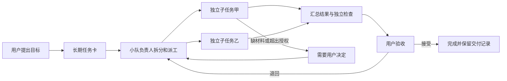

# Fleet Studio 多智能体协作方向建议

> 调研日期：2026-09-26。本文是方案候选，供讨论取舍；尚未成为正式需求，未修改代码或现有里程碑状态。
> 范围：8 个产品的官方资料、1 路现状侦察、1 路候选检索、1 路独立反审；来源与限制见各篇原始资料及[主会话核验](主会话核验.md)。

## 1. 推荐方向

建议将 Fleet Studio 做成**一个人带几支 AI 小队的项目工作台**：用户从任务看板发起工作，小队按职责交接，结果交回验收；现有模型池、排队、运行托管和历史记录继续负责执行。

这轮最重要的设计结论有三个：

1. **一张任务卡管一件要交付的事，可以经历多次执行和返工。** 程序正常退出，只说明这一轮结束；任务达标才进入完成。
2. **小队是可复用的分工和交接规则。** 负责人按需派成员，成员完成后回报；成员无需一直占用进程，先避免全员聊天和反复讨论。
3. **人的首页应先展示需要决定、需要验收的工作。** 资源占用、用量和日志仍然重要，适合放在运行监控入口。

暂按“先满足个人与小团队、同时覆盖开发和调研、本机优先”评估。用户尚未确认这些边界。若目标改为直接销售云端服务，需要单独补多用户、隔离、授权与运营设计。

## 2. 八个产品分别值得学什么

“官方说明”表示产品自己的文档承诺，本轮没有安装这些产品做完整验收。仓库中的设计文档与运行实现分别对待。

| 产品 | 工作围绕什么组织 | 最值得借鉴 | 适用边界 |
|---|---|---|---|
| [Multica](https://github.com/multica-ai/multica) | 长期任务、人、智能体、小队 | 同一任务串起背景、评论、多次运行、结果；小队负责人派工后退出，收到回报再继续 | 最接近目标形态。官方明确运行结束与任务完成分离；当前为带附加条件的源码许可 |
| [Paperclip](https://github.com/paperclipai/paperclip) | 公司目标、组织角色、任务、预算 | 任务独占认领、按事件唤醒、预算与人工决策入口 | 完整公司组织、招聘和战略审批增加学习成本，先选有用机制 |
| [Vibe Kanban](https://github.com/BloopAI/vibe-kanban) | 任务、独立工作目录、编码会话 | 一张任务连接多个工作空间；查看代码变化、反馈、合并形成完整路径 | 2026-04-10 公告公司关闭，项目拟由社区维护；云服务现状未实测，适合参考历史设计 |
| [Agent Orchestrator](https://github.com/Untrivial-ai/agent-orchestrator) | 项目主控、执行会话、代码合并申请与检查 | 从执行、测试、评审事实生成状态；失败反馈回原执行者；集中呈现“需要你” | 开发交付能力值得重点看。旧组织链接会重定向，部分文档与更新记录口径不一致 |
| [Gas Town](https://github.com/gastownhall/gastown) | 持久任务账本、协调者、执行者、合并角色 | 任务在会话退出后仍保留；合并有统一顺序；卡住能逐级交给人 | 角色与工具链复杂；完整终端流程在 Windows 上推荐 WSL，部分设计与当前实现关系待核 |
| [Conductor](https://www.conductor.build/) | 并行工作空间、编码 agent、交付审查 | 从查看正在做什么，到继续对话、检查变化、交付的路径短 | 当前官网已介绍云端隔离环境和多人协作，不能只按早期 Mac 本地工具理解；客户端与价格见专篇 |
| [Agor](https://github.com/preset-io/agor) | 分支、会话树、空间画布、长期队友 | 会话分支和回调、可复用操作区域、人员与智能体共用操作入口 | 画布位置和区域触发具有操作含义，学习与误操作成本需要考虑；首版没必要采用无限画布 |
| [Ruflo](https://github.com/ruvnet/ruflo) | 角色编排、共享记忆、工具与执行规则 | 少数职责明确的角色；任务认领；区分谁能修改哪些共享决定 | 本轮未找到可验证的完整持久任务看板；一个演示组件和未合并提案不足以判断全产品能力 |

建议重点学习顺序：**Multica 的任务和小队 → Agent Orchestrator 的交付反馈 → Paperclip 的任务认领与预算 → Gas Town 的恢复和合并秩序**。其余产品帮助校准交互、复杂度和边界。

Multica 官方看板图片可帮助理解任务形态：[查看原图](https://raw.githubusercontent.com/multica-ai/multica/12f8f3f31111564e5e1b9aac3f7f916e8bba4039/apps/docs/public/images/docs/workspace-overview.webp)。本轮已查看该图片，未登录应用进行交互测试。

## 3. Fleet 现有底座能保留什么

当前 [roadmap](../../roadmap.md) 记录 M0–M3、M5 已完成，M4、M6 进行中；M6 文档称实现与验证完成、等待用户确认。本轮不替用户完成该确认，常驻服务是否与全部最新代码一致未重新部署核对。

| 现在已有 | 后续用途 |
|---|---|
| 按优先级选择模型池、限制容量、公共排队 | 小队成员共享执行资源，继续控制并发 |
| 命令行派活、等待、续接、取消 | 保持主控会话的现有用法，给任务卡关联执行 |
| 每次执行的状态、时间线、输出与用量 | 在任务详情内解释这件事试过什么、哪里失败 |
| 角色提示词、独立评审与返工规范 | 变成可复用小队规则与结构化交付要求 |
| 总览、槽位、任务查询与筛选 | 保留为运行监控，复用主题、组件和交互基础 |

关键缺口：

- 当前“任务页”的主要对象仍是可续接的苦工会话，缺少跨多名执行者的长期业务任务。
- 任务归谁负责、依赖哪件事、交付什么、谁验收，目前主要靠任务书和主控会话维持。
- 已支持指定工作目录；本次抽查未见自动建立、回收独立工作目录的完整管理。提示词中的文件范围也不构成强制隔离。
- 看板目前主要用于观察，只有少量资源设置可改；从页面发起和推进业务任务需要补相应操作与权限。

本地证据入口：[会话与执行记录](../../../packages/core/src/domain/records.ts)、[运行状态](../../../packages/core/src/domain/status.ts)、[任务查询](../../../packages/daemon/src/store/taskRepo.ts)、[进程启动](../../../packages/daemon/src/process/spawnWorker.ts)、[接口模块](../../模块设计/服务层-接口.md)。主会话已通过 CodeGraph 抽查当前源码，目录管理边界经过侦察路纠正。

## 4. 用户实际怎样用

举一个候选使用场景：“把模型目录页做出来，并给我可验收结果”。

1. 用户建任务，选择项目，写目标、验收要求、允许操作的范围和执行限额，交给“开发小队”。
2. 负责人补齐必要问题，拆出能独立交付的子任务；缺材料或遇到取舍才提请用户决定。
3. 执行者分别工作。依赖未完成的任务等待，失败只返工相关部分。
4. 测试与评审分别提交证据。负责人检查整体目标，整理结果，交回“待验收”。
5. 用户打开结果，查看变化、截图、检查结果与剩余问题，选择接受或说明退回原因。
6. 退回继续沿用同一张任务卡，保留上一轮结果与决定；通过后再执行用户已授权的交付动作。

调研任务走同一条产品路径，交付物换成资料、来源和结论。任务卡无需天然绑定某个代码分支。

## 5. 看板和页面建议

第一版以五个入口为主，复用现有界面基础：

| 入口 | 用户来这里做什么 | 关键内容 |
|---|---|---|
| 待我处理 | 快速找到需要介入的工作 | 待验收、缺材料、超出限额、需要业务取舍 |
| 项目任务 | 创建工作、查看项目推进 | 任务看板与列表，共用同一批任务 |
| 小队 | 选择与调整可复用分工 | 负责人、成员职责、适用任务、执行限额 |
| 运行监控 | 查排队、故障、资源与花费 | 复用现有总览、槽位、执行查询 |
| 项目设置 | 维护稳定背景与授权范围 | 仓库/资料目录、项目说明、允许操作、交付规则 |

候选看板列：**待办 → 进行中 → 待验收 → 完成**，另设“受阻”。

卡片首先显示目标、负责人或小队、当前阻塞或下一步；子任务进度与执行中的提示按需要出现。任务详情集中展示目标、验收条件、分工、讨论、结果与历史。详细命令日志放在展开区域。

几个重要行为：

- 调整卡片位置与真正启动执行使用明确操作，避免一次整理看板意外重复派工。
- “排队中、重试中、运行失败”解释当前执行情况，不直接代表业务任务终态。
- 执行者自评通过后进入验收；只有满足交付规则，业务任务才完成。
- “暂停”“取消”“重新执行”的效果写清楚：是否结束当前执行、是否还会产生后续执行、已有结果怎样保留。
- 只把确实需要用户处理的事放进“待我处理”，避免每条日志都变通知。

## 6. 先做两套能交付的小队

### 调研小队：先验证通用协作

结构：1 名负责人 + 按对象拆分的收集成员 + 1 名独立核验者。

路径：明确问题 → 并行收集原始来源 → 独立核验关键事实与反证 → 负责人综合 → 用户验收。

交付包应包括来源、采集日期、事实与判断、未核实事项、建议和反对理由。核验者直接看原始资料，避免所有人共用一份带倾向的结论。

这次研究就是现成的验收样例：能否在一张任务卡里回看八份资料、纠正过程、独立反审和最终建议。

### 开发小队：复用已有开发与评审规矩

结构：1 名负责人 + 按文件/模块划界的实现成员 + 独立测试成员 + 独立评审成员。

路径：确定交付范围 → 并行实现 → 集成检查 → 独立评审 → 限定范围返工 → 人工验收或按既定规则交付。

要放行自动并行改同一仓库，必须同时解决工作目录、环境准备、测试端口与合并顺序。独立工作目录能减少同时写文件的冲突，最终合并仍需要检查。

先沿用现有 pi 执行能力。更多 CLI、模型品牌、头像与角色数量，只在真实任务提出需要时扩展。

## 7. “军团”落地需要的最小规则

| 必要规则 | 解决什么 | 可检查的结果 |
|---|---|---|
| 任务与执行分开保存 | 重试后任务与决定仍找得到 | 一张卡能看见多轮执行与验收 |
| 一个子任务有明确责任人 | 多人抢同一件事或互相等 | 并发认领只成功一次，转交有记录 |
| 显式依赖和交付条件 | 后一道拿到半成品就开始 | 前置交付通过才放行依赖任务 |
| 结果触发下一步，空闲负责人退出 | 反复聊天、无事空转 | 同一结果重复送达不会重复派工 |
| 限额、返工次数、超时 | 一项任务持续消耗却不收敛 | 达到限额停止新派工并说明原因 |
| 决定、证据和交接摘要持久保存 | 会话换了就丢上下文 | 重启后能说明做到哪、为何这样做 |
| 独立验收与退回 | 执行者一句“通过”就结束 | 能看到验收人、证据和退回原因 |

费用上限需要特别诚实：若上游用量延迟结算，停止新派工仍可能留下在途费用。先把并发、执行次数和时长限制做实；金额展示区分实际与估算，未知费用不能显示成零。

共享知识先保存项目背景、已确认决定、来源与任务交接摘要。是否需要向量检索或全局记忆，待资料规模和实际检索困难出现后再评估。

## 8. 三条实施路线的取舍

| 路线 | 收益 | 代价与成立前提 | 本轮建议 |
|---|---|---|---|
| 继续扩展 Fleet | 复用现有调度、角色、运行历史和 Windows 工具链；同时覆盖开发与调研 | 自己负责业务任务、小队和交付验收的完整产品设计 | 默认推荐，适合本项目持续演进 |
| 用 Multica 等现成前台，Fleet 负责执行 | 可以更快试到成熟任务交互 | 需要验证两边任务、取消、重试、权限和用量如何对应；本轮未验证现成连接器 | 作为限时试验候选，不能假定即插即用 |
| 直接采用现成产品 | 最快体验完整工作流，少维护一套界面 | 要接受其执行方式、部署条件和许可；现有 Fleet 能力是否仍需要另行评估 | 如果目标只是立即使用，很值得先实测 |

关于第二条路线，最危险的是两套系统同时认领、重试和结算同一件事。若试接，先指定唯一任务状态来源和唯一派工方，验证“一次点击只启动一次、取消后不复活、失败只重试一次、结果回到原卡”四个场景。

Multica 当前 LICENSE 含对外托管、商业嵌入和品牌附加条件。借鉴产品设计与直接复制代码是不同决策；若未来考虑直接采用其源码提供服务，须按具体条款评估。此事实不影响本轮产品形态调研。

## 9. 候选分期与退出标准

以下编号仅是后续讨论的占位建议，尚未写入正式 roadmap。现有 M4/M6 的未完成确认仍按原文管理。

| 候选阶段 | 应交付什么 | 通过什么场景算有用 |
|---|---|---|
| M7：业务任务与验收看板 | 项目任务、任务详情、关联多轮执行、结果、接受/退回、基础执行限额；现有命令行也能写回同一张卡 | 在卡片内发起一次调研，退回补证据，再验收完成；关闭主控会话后历史仍完整；老命令行任务不受影响 |
| M8：固定小队与接力 | 小队配置、子任务、认领、依赖、结果驱动继续、受阻升级；优先跑通调研小队 | 3 路资料收集加独立核验，一路失败只返工该路；重复事件不重复开工；重启后继续，保留人工决定 |
| M9：并行开发交付 | 开发小队、按需工作目录管理、环境准备、集成检查、独立评审、限定返工与统一合并 | 两路修改产生冲突时能识别并交给合并环节；测试失败不会被标完成；不覆盖已有未提交改动；中断能恢复或明确停在待处理 |

M7 已需要考虑数据迁移与界面写操作的权限；M8 需要能在主控会话退出后持续推进的后台负责人机制。它们都超出了给现有任务列表加几列的工作量。

暂缓：完整公司组织图、角色市场、无限画布、自动招聘、全自动长期经营、任意拖拽流程编辑器、大规模共享记忆网络。出现明确的使用案例后再决定是否加入。

## 10. 如何判断方向值得继续

先用现有工作验证三类任务：一次多来源调研、一次小功能开发、一次评审返工。评价重点是：

- 用户能否只看任务和结果，就知道做到哪、下一步由谁处理。
- 失败和退回后，是否还需要人手工搬运上下文、重新拆任务。
- 小队是否减少人工追问与重复执行，交付质量是否至少保持现有水平。
- 并行是否真的缩短交付过程，是否引入更多返工或合并麻烦。

本轮没有设定凭空的百分比收益，也没有证明用户会为此付费。Vibe Kanban 的关停提供了一条商业反证：用户多、免费使用活跃，并不能推出订阅可持续。若计划对外卖，需要另做买方和付费验证。

[独立反审](原始资料/09-独立反审.md)同样倾向先窄扩展，并提出一个停止条件：如果实际工作始终短小、互不依赖，也不需要持续验收，应保留现有监控台，暂停军团编排投入。若现成产品实测满足需求、使用者也愿意接受其执行方式，则直接采用仍可能更划算。本轮没有做这些安装与集成试验。

## 11. 下一轮只需确定的边界

1. 首先服务自己与少量协作者，还是直接面向外部付费团队。
2. 同时做开发与调研，还是先围绕一种任务形成完整闭环。
3. 小队负责人继续依附当前主控会话，还是要求关闭会话后也能后台推进。

我的推荐：**先本机自用、兼顾开发与调研，以调研小队验证协作机制，再接开发交付；看板先落地长期任务与验收，小队后台推进单独作为下一步能力。**

## 原始资料

- [01 Multica](原始资料/01-Multica.md)
- [02 Vibe Kanban](原始资料/02-Vibe-Kanban.md)
- [03 Paperclip](原始资料/03-Paperclip.md)
- [04 Gas Town](原始资料/04-Gas-Town.md)
- [05 Agent Orchestrator](原始资料/05-Agent-Orchestrator.md)
- [06 Agor](原始资料/06-Agor.md)
- [07 Conductor](原始资料/07-Conductor.md)
- [08 Ruflo](原始资料/08-Ruflo.md)
- [09 独立反审](原始资料/09-独立反审.md)
